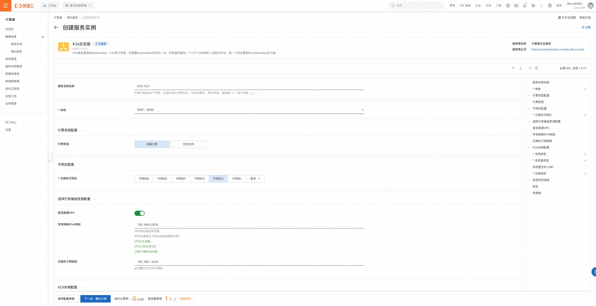
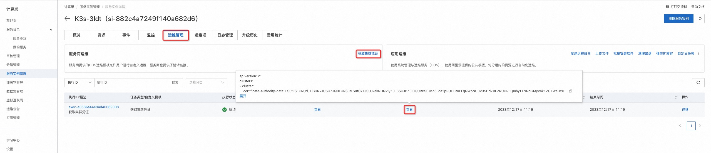
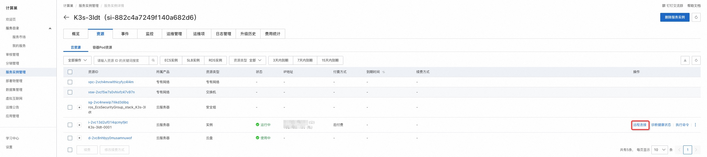
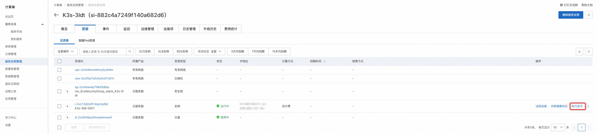
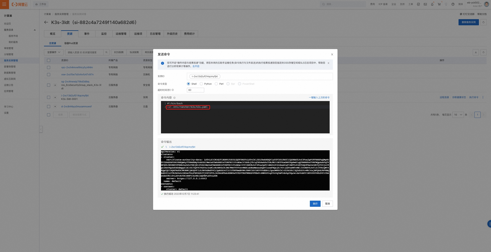
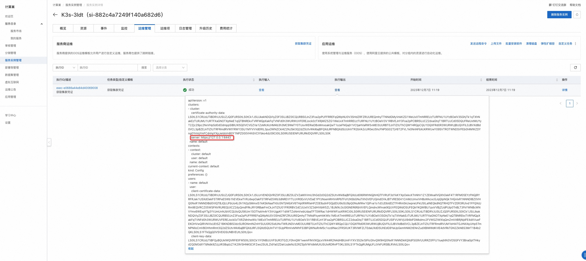
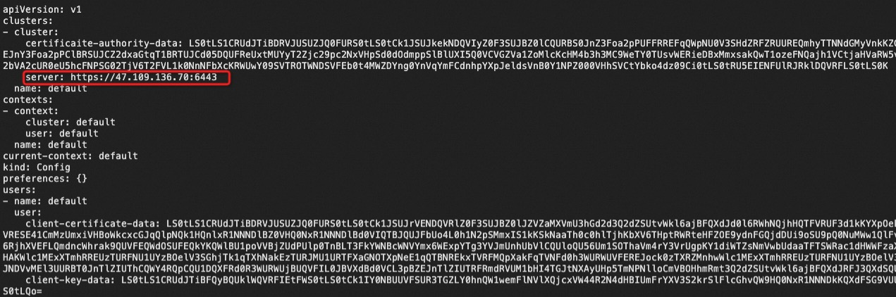
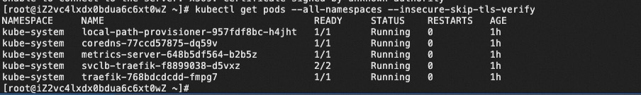

<h1>K3s Community Edition Service Instance Deployment Document </h1>

<h2> Overview </h2>

<a href = "https://docs.k3s.io/zh/">K3s</a> is a fully compatible Kubernetes release with the following enhancements:

<ul>
<li> is packaged as a single binary file. </li>
<li> Use a lightweight storage backend based on sqlite3 as the default storage mechanism. It also supports etcd3, MySQL, and Postgres. </li>
<li> Encapsulated in a simple startup program, it can handle many complex TLS and options. </li>
<li> is secure by default and has reasonable defaults for lightweight environments. </li>
<li> Added simple but powerful batteries-included functions, such:
<ul>
<li> Local storage provider </li>
<li>service load balancer</li>
<li>Helm controller</li>
<li>Traefik ingress controller</li>
</ul></li>
<li> All operations Kubernetes control plane components are encapsulated in a single binary file and process. As a result, K3s enables the automation and management of complex cluster operations (such as certificate distribution, etc.). </li>
<li> Minimizes external dependencies, and K3s only requires modern kernels and cgroup mounts. K3s packages the required dependencies, including:
<ul>
<li>containerd</li>
<li>Flannel (CNI)</li>
<li>CoreDNS</li>
<li>Traefik (Ingress)</li>
<li>Klipper-lb (Service LB)</li>
<li> Embedded Network Policy Controller </li>
<li> Embedded local-path-provisioner</li>
<li> Host utilities (iptables, socat, etc.)</li>
</ul></li>
</ul>

 This article introduces you to the process and instructions for deploying an instance based on the K3s Community Edition service. 

<h2> Billing instructions </h2>

 The cost of the K3s community edition on the computing nest mainly involves:

<ul>
<li> Selected vCPU and Memory Specifications </li>
<li> Disk capacity </li>
<li> Internet bandwidth </li>
</ul>

 Billing methods include:

<ul>
<li> Pay-As-You-Go (hourly)</li>
<li> monthly package </li>
</ul>

 The estimated cost is visible in real time when the instance is created. 

<h2> Deployment Architecture </h2>

K3s Community Edition is a stand-alone deployment architecture. 

<h2> Permissions required for RAM accounts </h2>

 The K3s community edition service needs to access and create resources such as ECS and VPC. If you use a RAM user to create a service instance, you need to add the corresponding resource permissions to the account of the RAM user before creating the service instance. For more information about how to add RAM permissions, see <a href = "https://help.aliyun.com/document_detail/121945.html"> Authorize RAM users </a>.
. The required permissions are shown in the following table. 

<table>
<thead>
<tr>
<th> Permission policy name </th>
<th> Remarks </th>
</tr>
</thead>
<tbody>
<tr>
<td>AliyunECSFullAccess</td>
<td> Permissions to manage ECS </td>
</tr>
<tr>
<td>AliyunVPCFullAccess</td>
<td> Permissions for managing VPC networks </td>
</tr>
<tr>
<td>AliyunROSFullAccess</td>
<td> Manage permissions for Resource Orchestration Services (ROS) </td>
</tr>
<tr>
<td>AliyunComputeNestUserFullAccess</td>
<td> Manage user-side permissions for the compute nest service (ComputeNest) </td>
</tr>
<tr>
<td>AliyunCloudMonitorFullAccess</td>
<td> Permissions to manage CloudMonitor (CloudMonitor) </td>
</tr>
</tbody>
</table>

<h2> Deployment process </h2>

<h3> Deployment steps </h3>

 Click <a href = "https://computenest.console.aliyun.com/service/instance/create/cn-hangzhou?type=user&ServiceId=service-2f7333225ee342ee8fa7"> Deploy Link </a>
, enter the service instance deployment interface, according to the interface prompt, fill in the parameters to complete the deployment. 

<h3> Deployment parameters </h3>

 When you create a service instance, you need to configure the service instance information. The following section describes the details of the K3s Community Edition service instance input parameters. 

<table>
<thead>
<tr>
<th> Parameter group </th>
<th> Parameter item </th>
<th> Example </th>
<th> Description </th>
</tr>
</thead>
<tbody>
<tr>
<td> Service instance name </td>
<td></td>
<td>test</td>
<td> Name of the instance </td>
</tr>
<tr>
<td> Region </td>
<td></td>
<td> China (Hangzhou)</td>
<td> Select the region of the service instance. We recommend that you select the region nearby to obtain better network latency. </td>
</tr>
<tr>
<td> Availability Zone Configuration </td>
<td> Deployment area </td>
<td> Availability Zone I</td>
<td> Different available regions in the region </td>
</tr>
<tr>
<td> Payment type configuration </td>
<td> Payment type </td>
<td> Pay-As-You-Go or Subscription </td>
</tr>
<tr>
<td> Select an existing basic resource configuration </td>
<td>VPC ID</td>
<td>vpc-xxx</td>
<td> Select the ID of the VPC. </td>
</tr>
<tr>
<td> Select an existing basic resource configuration </td>
<td> Switch ID</td>
<td>vsw-xxx</td>
<td> Select the switch ID. If the switch cannot be found, try switching the region and zone. </td>
</tr>
<tr>
<td>ECS instance configuration </td>
<td> Instance type </td>
<td>ecs.g6.large</td>
<td> Instance type, which can be selected according to actual needs </td>
</tr>
<tr>
<td>ECS instance configuration </td>
<td> System disk space </td>
<td>40</td>
<td> System disk space can be selected according to actual needs </td>
</tr>
<tr>
<td>ECS instance configuration </td>
<td> Data disk space </td>
<td>40</td>
<td> Data disk space, which can be selected according to actual needs </td>
</tr>
<tr>
<td>ECS instance configuration </td>
<td> Instance password </td>
<td><strong><em>*</strong></em>*</td>
<td> Set the instance password. It is 8 to 30 characters in length and must contain three items (uppercase letters, lowercase letters, numbers, ()'~!@#$%^& *-+ ={}[]:;' <>,.?/special symbols)</td>
</tr>
</tbody>
</table>

<h3> Verify Results </h3>

<ol>
<li>
 View the service instance.
After the service instance is created successfully, the deployment time takes about 2 minutes. After the deployment is complete, the corresponding service instance is displayed on the page. 
</li>
<li>
 Obtain cluster access credentials:

<ul>
<li>
 method 1: on the operation and maintenance management page, select the operation and maintenance item of "obtaining cluster certificate" and view the certificate in the execution result

</li>
<li>
 method 2: remotely connect to the service node and obtain the access credential:/etc/rancher/k3s/k3s.yaml

</li>
<li>
 Method 3: Send a remote command: cat /etc/rancher/k3s/k3s.yaml to view the execution result of the command

</li>
</ul></li>
<li>
 Configure credentials on nodes outside the cluster to access the cluster:

<ul>
<li> private network access: write the credential file in ~/.kube/config, replace the server-ip in the credential with the private network IP of the service instance (obtained on the overview page), and use the kubectl command to access the cluster.

<pre><code>kubectl get pods --all-namespaces
</code></pre></li>
<li> public network access: write the credential file in ~/.kube/config, replace the server-ip in the credential with the public IP of the service instance (obtained on the overview page), and use the kubectl command to access the cluster.
<pre><code>kubectl get pods --all-namespaces --insecure-skip-tls-verify
</code></pre>
</li>
</ul></li>
</ol>

<h3> Using K3s</h3>

 Please visit the K3s official website to learn how to use K3s:<a href = "https://docs.k3s.io/zh/">K3s usage documentation </a>

